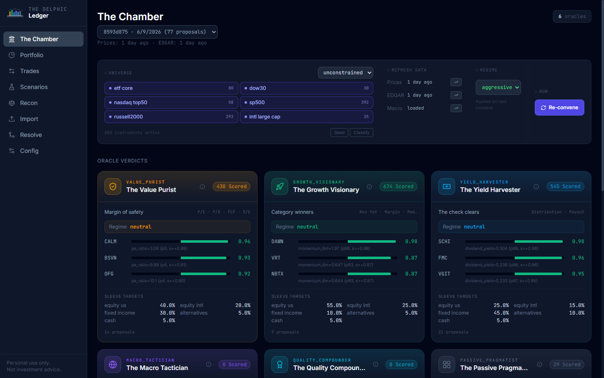
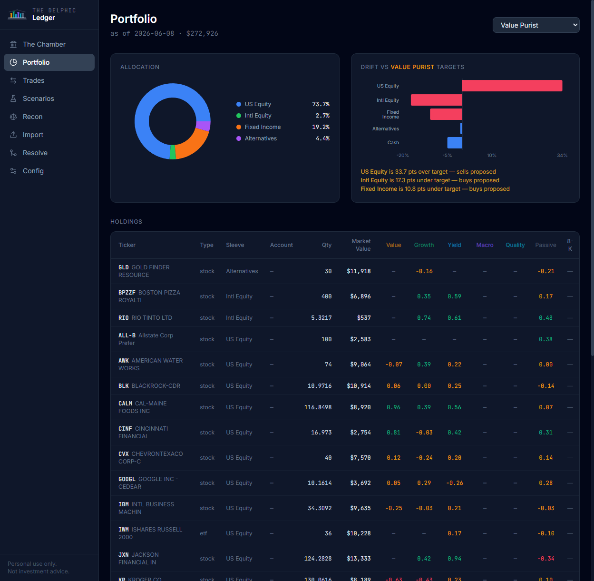

<div align="center">


# The Delphic Ledger

> *"Know thy holdings."* — after the inscription at the Temple of Apollo at Delphi

**Six oracles. Zero consensus. No predictions.**

[](https://github.com/ericdipietro-collab/TheDelphicLedger/actions/workflows/ci.yml)
[](https://python.org)
[](LICENSE)
[](https://github.com/astral-sh/uv)

</div>

---

A personal portfolio analysis tool and engineering showcase. Import real positions and transactions from broker CSVs, reconcile them against a transaction ledger, enrich them with market data and SEC filings, then convene six investor archetypes who score the portfolio through incompatible philosophies and propose conflicting rebalancing trades.

**This is not a portfolio optimizer. It is a structured disagreement engine built on production-grade financial data mechanics.** No advice. No execution. No predictions. The oracles exist to make you think harder — not to think for you.

---

## Why this is different from other portfolio tools

Most portfolio analysis tools are optimization engines. They take your holdings and find the mathematically optimal reallocation — minimize variance, maximize Sharpe, target a frontier.

Six investor archetypes — a value purist, a growth visionary, a yield harvester, a macro tactician, a quant, and a passive pragmatist — each score your portfolio through an incompatible lens. They propose conflicting trades. They object to each other's reasoning. The Dissent Matrix shows you everywhere they disagree.

The disagreement is not a bug to be resolved. It's the point. Real investors disagree about the same data. Making that disagreement explicit — and tracking it in an immutable audit log — is what this project demonstrates.

---

## Dashboard

<div align="center">

| The Chamber | Portfolio |
|:---:|:---:|
|  |  |

</div>

---

## Disclaimer

**Not investment advice.** This tool is for personal entertainment and educational purposes only. It produces theoretical trade proposals; a human decides what, if anything, to do. The author makes no market calls, offers no guidance, and operates no service for others. All outputs are local and gitignored. Use at your own risk and consult a qualified financial professional for actual investment decisions.

---

## What this demonstrates

This project is an engineering showcase for capital-markets data architecture:

| Capability | Where |
|---|---|
| **Entity resolution with human-in-the-loop conformance** | `committee resolve` — fuzzy-match instrument names, queue ambiguous cases, require human confirmation for below-threshold matches |
| **Event-sourced reconciliation** | `committee recon` — roll forward transaction ledger between snapshots; flag qty breaks; never mutate source records |
| **Constraint-based portfolio logic** | `profiles/*.yaml` — declarative constraint profiles (fund-only, min yield, etc.) consumed by a single shared rebalancer |
| **Deterministic what-if replay** | `committee scenario gfc-2008` — shock sleeve MVs and re-run all oracles; audit row marks it a scenario |
| **Point-in-time data discipline** | `committee backtest` — oracle scores only see data stamped ≤ replay date; lookahead test enforces this |
| **Hysteresis state machine** | Macro Tactician regime FSM — asymmetric entry/exit bands, two-run confirmation, circuit breaker |
| **Immutable audit log** | Every convene/dissent/deviation writes a row; no UPDATE/DELETE on source records ever |

---

## Architecture

```
 broker CSVs (positions, transactions)
        │
        ▼
 ┌──────────────────────────────────────────────┐
 │ INGEST  raw batches (immutable, hashed)      │
 │  header mapper <-> user-corrected templates  │
 │  instrument resolver -> mapping_decisions    │
 │  unresolved queue -> human confirm           │
 └──────────────┬───────────────────────────────┘
                ▼
 ┌──────────────────────────────────────────────┐
 │ CORE  instruments (security master)          │
 │       position_snapshots · transactions      │
 │       lots · holdings (derived, household)   │
 │       recon_breaks                           │
 └──────┬──────────────────────────┬────────────┘
        ▼                          ▼
 ┌──────────────────┐   ┌─────────────────────────┐
 │ MARKET DATA      │   │ RECON ENGINE            │
 │ prices · FRED    │   │ qty roll-forward between│
 │ EDGAR XBRL/8-K   │   │ snapshots vs txn ledger │
 │ universe loader  │   └─────────────────────────┘
 └──────┬───────────┘
        ▼
 ┌──────────────────────────────────────────────┐
 │ ORACLES (6 persona configs)                  │
 │ each: per-holding scores + sleeve targets    │
 │       + persona constraints                  │
 └──────────────┬───────────────────────────────┘
                ▼
 ┌──────────────────────────────────────────────┐
 │ REBALANCER (single, shared)                  │
 │ f(scores, targets, holdings, lots,           │
 │   constraint profile) -> TradeProposal       │
 └──────────────┬───────────────────────────────┘
                ▼
 ┌──────────────────────────────────────────────┐
 │ OUTPUT  CLI (committee ...) · local web      │
 │ dashboard · decision audit log · scenarios   │
 └──────────────────────────────────────────────┘
```

**Key invariant:** oracles emit `(per_holding_scores, sleeve_targets, persona_constraints)` — never trades. One shared rebalancer produces all trades. Import-linter enforces this in CI.

---

## The Six Oracles

| Oracle | Philosophy | Drift from consensus |
|---|---|---|
| **The Value Purist** | P/E, P/B, FCF yield; moats matter | Ignores momentum entirely |
| **Growth Visionary** | Revenue growth, margin expansion | Pays up; ignores current valuations |
| **Yield Harvester** | Dividend yield, payout coverage | Avoids low-yield equities |
| **Macro Tactician** | Regime FSM: yield curve, credit spreads, VIX, Sahm | Tilts sleeves; ignores individual securities |
| **The Quant** | Momentum, RSI, beta, MA-cross | Ignores fundamentals |
| **Passive Pragmatist** | Expense ratio, diversification, drift | Scores no individual securities; votes no-change |

Each oracle scores through its own philosophy. They frequently disagree. That disagreement is the point.

---

## The Pre-committed Pass Bar

The Macro Tactician's regime tilt earns live influence only if it passes a pre-stated bar (evaluated in `committee backtest`):

- Cuts max drawdown **≥20% relative** to the Passive Pragmatist benchmark
- Costs **≤1% CAGR** vs. the benchmark
- Produces **fewer than 10 regime switches per decade**

Fails any criterion → Macro Tactician falls back to neutral allocation and is labeled **entertainment-only** in `committee dissent`. This is not a post-hoc rationalization — the bar is committed in `backtest/engine.py` before the backtest runs.

---

## Installation

```bash
git clone https://github.com/ericdipietro-collab/TheDelphicLedger
cd DelphiLedger
uv sync
uv run committee --help
```

Requirements: Python 3.12+, [uv](https://github.com/astral-sh/uv), Node.js v18+ (for dashboard build).

`pip install delphic-ledger` → `committee --help` (once published to PyPI).

---

## Synthetic walkthrough

This walkthrough uses only synthetic data. No real portfolio data is needed.

### 1. Seed the demo database

```bash
uv run committee demo
```

Seeds 5 synthetic Vanguard instruments, a demo account, holdings, and macro market data. Runs all six oracles. No interactive prompts.

To seed and open the dashboard in one step:

```bash
uv run committee demo --open
```

(Requires Node.js v18+ for the first-run dashboard build.)

### 2. Reconcile

```bash
uv run committee recon run
uv run committee recon list
```

Rolls forward the transaction ledger between position snapshots. Lists any quantity breaks.

### 3. Convene the committee

```bash
uv run committee convene
```

Runs all six oracles, proposes trades per oracle, writes audit rows.

### 4. Inspect disagreements

```bash
uv run committee dissent
```

Side-by-side: which oracle buys/sells each instrument, and which rivals object to each other's proposals.

### 5. Run a scenario

```bash
uv run committee scenario gfc-2008
```

Shocks sleeve market values per the pack's calibrated factors. Re-runs all oracles. See how each philosophy responds to a 40% equity drawdown.

### 6. Backtest the tilt

```bash
uv run committee backtest --from 2022-01-01 --perturb
```

Point-in-time replay of Macro Tactician's regime tilt vs. Passive Pragmatist benchmark. Reports CAGR, max drawdown, Ulcer index, switch counts, pass-bar verdict, and ±50% drift-parameter sensitivity.

### 7. Launch the dashboard

```bash
uv run committee serve --db data/demo.db
```

Opens `http://127.0.0.1:7777` — six oracle cards, dissent matrix, portfolio donut, drift gauges, trade proposals, scenario theater, recon view.

---

## Project structure

```
src/committee/
  ingest/       CSV parsing, header mapping, batch tracking
  resolver/     Fuzzy instrument resolution, unresolved queue
  core/         Shared types, holdings derivation
  market/       Price fetcher, FRED, EDGAR XBRL cache
  signals/      Macro signals, regime FSM (composite, regime)
  oracles/      Six oracle configs + runner + metric computation
  rebalancer/   Shared rebalancer, constraint profiles, drift engine
  recon/        Quantity reconciliation engine
  lots/         Tax lot derivation (FIFO + fallback), unwind analysis
  scenarios/    YAML scenario packs (historical + hypothetical)
  backtest/     Point-in-time backtest engine, pass-bar evaluation
  api/          FastAPI read-only local API (never 0.0.0.0)
  cli.py        Typer entry point
oracles/        YAML persona configs (one per oracle)
scenarios/      YAML scenario packs (6 frozen packs)
profiles/       Constraint profiles (personal profiles gitignored)
dashboard/      React + Vite + Recharts frontend
tests/          280 tests across all modules
docs/ADR/       Architecture decision records
```

---

## Honest limitations

**Tactical value is episodic.** The Macro Tactician's tilt has shown value in some regimes and been noise in others. The pass-bar exists to discipline this honestly.

**Parameter humility.** Run `committee backtest --perturb` to see how sensitive results are to ±50% changes in the drift band. If the outcome flips, the result is fragile.

**The real edge is discipline, not prophecy.** This tool's value is:
- Forcing you to articulate what you own and why
- Maintaining a clean audit trail of every trade proposal and deviation
- Tax-lot awareness before selling
- Drift control against stated targets
- Scenario discipline (shocks, not optimism)

The oracles are entertainment wrapped around that discipline.

**No forward-looking metrics.** No expected returns are estimated. No DCF. No price targets. Oracles score current observable data against their philosophies.

---

## Development

```bash
uv sync --extra dev
uv run pytest
uv run ruff check src/
```

Import constraints are enforced by `import-linter`:

```bash
uv run lint-imports
```

---

## License

MIT. See LICENSE.

The author never operates this tool as a service. This is a locally run personal tool and engineering demonstration.
