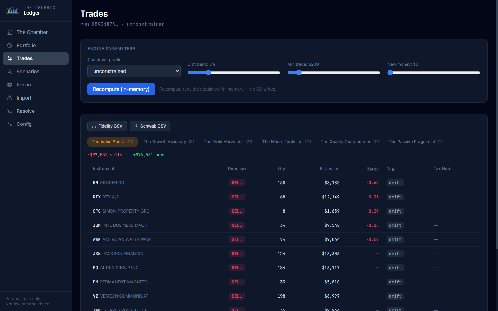
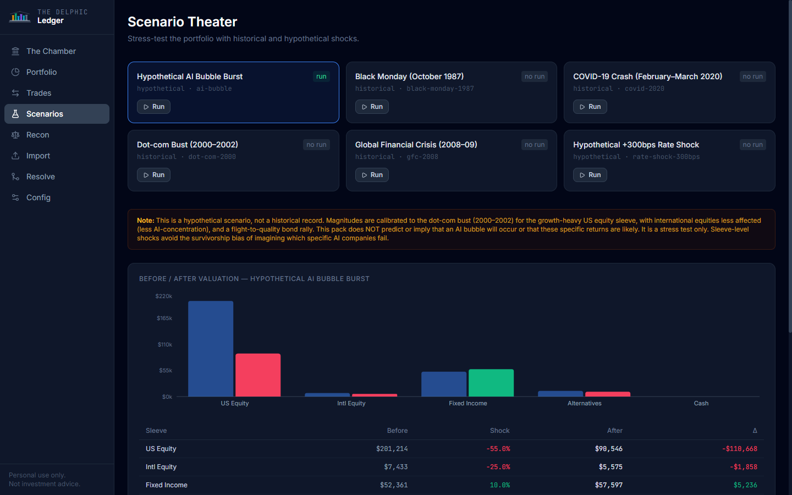

<div align="center">
  
</div>

# The Delphic Ledger

[](https://github.com/ericdipietro-collab/TheDelphicLedger/actions/workflows/ci.yml)
[](https://www.python.org/downloads/)
[](LICENSE)

> *"Know thy holdings."* — after the inscription at the Temple of Apollo at Delphi

**Six oracles. Zero consensus. No predictions.**

A local portfolio analysis engine and engineering showcase. Import real broker exports, reconcile them against your transaction ledger, enrich with live market data and SEC filings, then convene six investor archetypes — each applying an incompatible philosophy to score your holdings and propose conflicting rebalancing trades.

> **Not investment advice.** The oracles are fictional characters; their scores and trade proposals are entertainment built on real-world mechanics. Nothing here should be construed as a recommendation to buy, sell, or hold any security.

---

## Screenshots


*The Chamber — six oracle verdicts, regime state, and the control panel for universe, data refresh, and convening.*


*Portfolio — allocation breakdown with per-oracle scores and drift-vs-target chart.*


*Trades — rebalancing proposals per oracle with direction, quantity, estimated value, and score. Export to Fidelity or Schwab batch CSV.*


*Scenario Theater — stress-test the portfolio against historical crashes and hypothetical shocks.*

---

## What this demonstrates

| Capability | Where |
|---|---|
| Entity resolution with human-in-the-loop conformance | `committee resolve`, `mapping_decisions` audit table |
| Fuzzy header mapping for heterogeneous CSV formats | `ingest/` — Fidelity, Schwab, Vanguard, iShares, SPDR |
| Event-sourced reconciliation (snapshots + transaction ledger) | `committee recon` |
| Constraint-based portfolio optimization | `profiles/`, `rebalancer/` |
| Deterministic what-if replay (scenario packs) | `committee scenario` |
| Point-in-time data discipline — no fabricated metrics | EDGAR XBRL cache, FRED, price freshness SLAs |
| Multi-oracle scoring with full audit trail | `decisions`, `deviations` tables |
| Local-only FastAPI + React dashboard | `committee serve` |

Stack: Python 3.12 · SQLAlchemy + SQLite · Typer + Rich · FastAPI · React + Vite + Recharts · yfinance / Tiingo · SEC EDGAR XBRL · FRED

---

## Quick start — no real data required

```bash
# 1. Clone and install
git clone https://github.com/ericdipietro-collab/TheDelphicLedger.git
cd TheDelphicLedger
pip install uv          # or: brew install uv / scoop install uv
uv sync

# 2. Seed a synthetic demo and open the dashboard in one command
uv run committee demo --open
```

`demo --open` seeds a self-contained `data/demo.db` with synthetic positions, transactions, market data, and pre-run oracle verdicts, then opens the dashboard at `http://127.0.0.1:7777`. No API keys, no real data required.

> **Python 3.12+ required.** `uv sync` creates an isolated virtualenv automatically.

---

## Using your own portfolio data — step by step

### Step 1 — Import broker CSVs

Export positions and transaction history from your broker. Fidelity, Schwab, and Vanguard are recognized automatically; other formats are mapped interactively on first import.

```bash
uv run committee import-file examples/schwab_positions.csv
uv run committee import-file examples/schwab_transactions.csv
```

On first import of an unknown format, the header mapper runs a fuzzy match and prompts you to confirm or correct each column. Your confirmation is saved as a reusable template in `profiles/`.

### Step 2 — Resolve instruments

Anything the auto-resolver couldn't confidently identify lands in a queue. Nothing below the confidence threshold is silently accepted — every decision is written to `mapping_decisions`.

```bash
uv run committee resolve
# or use the Resolve page in the dashboard
```

### Step 3 — Start the dashboard

```bash
uv run committee serve
# opens http://127.0.0.1:7777 automatically
```

### Step 4 — Fetch market data

In the Chamber's **Refresh data** panel, trigger each data source:

- **Fetch prices** — 380-day EOD prices for all holdings + active universe. Fetches ~850 tickers in parallel (~30s via yfinance batch download; faster with a Tiingo key).
- **Fetch EDGAR** — SEC XBRL annual fundamentals for held stocks and universe stocks. Required for Value, Quality Compounder, and Growth oracles to score equities.
- **Fetch macro** — FRED series: T10Y3M, CPI, DXY, VIX, credit spreads. Required for the Macro Tactician regime signal.

A progress bar appears in the UI while each fetch runs. Staleness dates update once the fetch completes.

### Step 5 — Seed the buy universe (optional)

By default, oracles only score your existing holdings. To let them consider buy candidates from a broader universe, use the **Universe** section in the Chamber:

1. Click **Seed** next to any bundle (e.g., `sp500`, `etf_core`) — registers its instruments in the database
2. Toggle bundles active/inactive
3. Click **Fetch prices** again — only newly-added tickers download; existing ones are skipped
4. Re-convene — oracles now score and propose across the full universe

Available bundles: `etf_core` (~80 ETFs), `dow30`, `nasdaq_top50`, `sp500` (~450 components), `russell2000` (~300 small-caps), `intl_large_cap` (35 international ADRs).

### Step 6 — Convene the oracles

Click **Re-convene** in the Chamber, or run from the CLI:

```bash
uv run committee convene
```

Each run writes a full audit row to `decisions` — inputs, all six oracle scores, all proposals. Switch between oracle tabs in **Trades** to compare proposals side by side. Use the **Portfolio** page to see how each oracle scores your individual holdings and where each sleeve drifts from that oracle's target allocation.

### Step 7 — Explore scenarios (optional)

Replay a historical or hypothetical shock against your current portfolio. All six oracles re-score deterministically under the scenario's price and macro overrides:

```bash
uv run committee scenario list
uv run committee scenario run gfc_2008
```

Scenario packs live in `scenarios/` as YAML files. No market dynamics are simulated — shocks are hardcoded overrides applied to the existing data model.

---

## The six oracles

Each oracle applies a single pre-committed investment philosophy. They score independently and never share state.

| Oracle | Philosophy | Key signals |
|---|---|---|
| **The Value Purist** | Margin of safety — only buys below intrinsic value | P/E · P/B · FCF yield · D/E |
| **The Growth Visionary** | Category winners compounding at scale | Revenue YoY · margin trend · 6m momentum |
| **The Yield Harvester** | The check clears — income above all | Distribution yield · payout ratio · dividend streak |
| **The Macro Tactician** | Regime-aware ballast | T10Y3M · CPI · DXY · VIX |
| **The Quality Compounder** | Business economics first | ROIC · gross profitability · accruals ratio · D/E |
| **The Passive Pragmatist** | Cost and concentration are the enemy | Expense ratio · HHI · implied turnover |

Oracles emit scores, sleeve targets, and persona constraints — never trades. A single shared rebalancer consumes all oracle output and produces `TradeProposal` objects per oracle.

The **Macro Tactician** is unique: it reads macro signals to set sleeve-level allocation tilts (equity, fixed income, alternatives) that the other oracles must satisfy. It uses asymmetric enter/exit bands with two-run confirmation to avoid flip-flopping on noise.

The **Quality Compounder** implements the Novy-Marx quality factor: gross profit / total assets, combined with ROIC and an accruals ratio (lower accruals = earnings backed by cash, not accounting choices). Indifferent to price — a mediocre business is still mediocre even when cheap. Rivals both the Value Purist ("paying up for quality") and the Growth Visionary ("growth without quality is just revenue expansion").

---

## Buy universe bundles

| Bundle | Contents |
|---|---|
| `etf_core` | ~80 diversified ETFs (equity, fixed income, sectors, factors, alternatives, international) |
| `dow30` | 30 DJIA components |
| `nasdaq_top50` | 50 largest Nasdaq-listed stocks |
| `sp500` | ~450 S&P 500 components (static snapshot) |
| `russell2000` | ~300 representative small-cap stocks |
| `intl_large_cap` | ~35 international ADRs (UK, Europe, Asia-Pacific, Canada, India) |

Custom bundles: add a YAML file to `bundles/` following the existing format, then `committee universe enable <name>`.

---

## Configuration

Adjustable from the Config page or via API:

| Parameter | Default | Description |
|---|---|---|
| `drift_abs` | 5% | Absolute sleeve drift before rebalancing triggers |
| `drift_rel` | 25% | Relative sleeve drift before rebalancing triggers |
| `min_trade_usd` | $200 | Minimum trade size (filters noise) |
| `new_money` | $0 | Fresh cash to deploy before any sells |

Constraint profiles (e.g. `funds_only`) restrict the trade universe at convene time.

---

## Optional API keys

No keys are required to run the demo or use your own data. Keys improve data quality and speed:

| Key | What it unlocks |
|---|---|
| `TIINGO_API_KEY` | Faster, more reliable price fetches; better dividend/adjusted-close data |
| `FRED_API_KEY` | FRED macro series — free key at [fred.stlouisfed.org](https://fred.stlouisfed.org/docs/api/api_key.html) |

Set as environment variables before `committee serve`.

---

## Dashboard development

The dashboard is pre-built (`dashboard/dist/`) and served by the backend. For hot-reload development:

```bash
uv run committee serve --no-open &   # backend on :7777
cd dashboard && npm install && npm run dev
# open http://localhost:5173
```

---

## Stack

| Layer | Technology |
|---|---|
| Language | Python 3.12 |
| Package manager | uv |
| ORM / DB | SQLAlchemy + SQLite (Postgres-ready via connection string) |
| CLI | Typer + Rich |
| Tests | pytest (330 tests) |
| Linter | ruff |
| Type checking | mypy strict on `core/`, `oracles/`, `rebalancer/`, `signals/` |
| Dashboard API | FastAPI (local-only, binds 127.0.0.1) |
| Dashboard UI | React + Vite + Tailwind + Recharts |
| Market data | yfinance (default, no key) · Tiingo (optional) |
| Macro data | FRED (St. Louis Fed public API) |
| Fundamentals | SEC EDGAR XBRL |

---

## Architecture invariants

Enforced in code and checked by import-linter in CI:

- **Oracles never emit trades.** One shared rebalancer owns all `TradeProposal` objects. `oracles/` must not import `rebalancer/`.
- **Source records are immutable.** Import batches, position snapshots, transactions — never updated or deleted, only appended.
- **No LLM in any decision path.** All scoring is deterministic pure Python, reproducible from the same inputs. An optional narration layer (off by default) describes already-made decisions and never feeds back into scoring.
- **`Decimal` throughout.** `float` is never used for monetary amounts or share quantities.
- **No fabricated metrics.** Every number is computed from a sourced input or rendered as `"n/a"`. Stale data is flagged, not silently carried forward.
- **Dashboard binds 127.0.0.1 only.** Never `0.0.0.0`.

See `CLAUDE.md` for the full invariant set and `docs/delphic-ledger-design.md` for the complete design document.

---

## Running tests

```bash
uv run pytest          # 330 tests
uv run ruff check .
uv run mypy src/committee/core src/committee/oracles src/committee/rebalancer src/committee/signals
```

---

## Project status

| Milestone | Status |
|---|---|
| M1 — Schema, import, mapping, holdings | Complete |
| M2 — Market data, bundle system, FRED, EDGAR | Complete |
| M3 — Reconciliation engine | Complete |
| M4 — Oracles, rebalancer, constraint profiles | Complete |
| M5 — Scenario packs | Complete |
| M6 — Tax lots, unwind queue | Complete |
| M7 — Dashboard (FastAPI + React) | Complete |
| M8 — Backtest, README, demo | Complete |

---

## Data privacy

`data/` is gitignored. Real portfolio data lives only on your machine. The repo ships synthetic examples in `examples/` and `profiles/`. No CI job fetches live market data or publishes generated output.

---

*Personal portfolio analysis and engineering showcase. Locally run. Not investment advice.*
